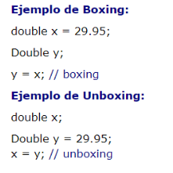

<div align="justify">

#  Code & Learn (Clases envolventes)

Para cada uno de los tipos de datos primitivos existen una clase de envoltura asociada:

| Tipo primitivo | Clase envolvente |
| --- | --- |
| byte | Byte |
| short | Short |
| int | Integer |
| long | Long |
| float | Float |
| double | Double |
| char | Character |
| boolean | Boolean |

Estas clases proporcionan métodos que permiten manipular el tipo de dato primitivo como si fuese un objeto.

```java
//Ejemplo seudocodigo
public class PruebaDatosPrimitivos {

	public static void main(String[] args) {

		System.out.println("Máximo y mínimo valor para un tipo de dato byte:");
		System.out.println(Byte.MIN_VALUE + " " + Byte.MAX_VALUE);
		System.out.println("Máximo y mínimo valor para un tipo de dato short:");
		System.out.println(Short.MIN_VALUE + " " + Short.MAX_VALUE);
		System.out.println("Máximo y mínimo valor para un tipo de dato int:");
		System.out.println(Integer.MIN_VALUE + " " + Integer.MAX_VALUE);
		System.out.println("Máximo y mínimo valor para un tipo de dato long:");
		System.out.println(Long.MIN_VALUE + " " + Long.MAX_VALUE);
		System.out.println("Máximo y mínimo valor para un tipo de dato float:");
		System.out.println(Float.MIN_VALUE + " " + Float.MAX_VALUE);
		System.out.println("Máximo y mínimo valor para un tipo de dato double:");
		System.out.println(Double.MIN_VALUE + " " + Double.MAX_VALUE);
	}

}
```

Las conversiones entre los tipos primitivos y sus clases envolventes son automáticas. No es necesario hacer un casting. Para realizarlas se utiliza el Boxing/Unboxing.

**Boxing:** Convertir un tipo primitivo en su clase Wrapper.

**Unboxing:** Convertir un objeto de una clase Wrapper en su tipo primitivo.



## Clase Integer

En la siguiente tabla aparecen algunos métodos de la clase Integer. El resto de
clases envolventes correspondientes a tipos primitivos numéricos tienen
métodos similares.

| Método | Descripción | Ejemplo |
| --- | --- | --- |
| Integer(int valor) | Constructor a partir de un int | Integer n=new Integer(20); |
| Integer(String valor) | Constructor a partir de un String | String s=”123456”;
Integer a=new Integer(s); |
| int intValue()
float floatValue()
double doubleValue()
… | Devuelve el valor equivalente | Integer n=new Integer(30);
int x=n.intValue();
double y=n.doubleValue(); |
| int parseInt(String s) | Método estático que devuelve un int a partir de un String | String s=”123456”;
int z=Integer.parseInt(s); |
| String toBinaryString(int i)
String toOctalString(int i)
String toHexString(int i) | Métodos estáticos que devuelven un String con la representación binaria, octal o hexadecimal del número | int numero=12;
String hexa=Integer.toHexString(numero); |
| Integer valueOf(String s) | Método estático que devuelve un Integer a partir de un String | Integer m=Integer.valueOf(”123”); |

## Clase Character

Provee una serie de métodos para manipular los datos de tipo char. En la siguiente tabla aparecen algunos de estos métodos.

| Método | Descripción | Ejemplo |
| --- | --- | --- |
| Character(char c) | Constructor a partir de un char | char car=’x’;
Character a=new Character(char); |
| char charValue() | Devuelve el char equivalente | Character n=new Character(’q’);
char c=n.charValue(); |
| boolean isLowerCase(char ch)
boolean isUpperCase(char ch)
boolean isDigit(char ch)
boolean isLetter(char ch) | Comprueba si es un carácter en minúscula
Comprueba si es un carácter en mayúscula
Comprueba si es un dígito (0 al 9)
Comprueba si es una letra
Todos son estáticos | if(Character.isUpperCase(c) {
   ….
} |
| char toLowerCase(char ch)
char toUpperCase(char ch) | Devuelve el char en mayúscula
Devuelve el char en minúscula
Métodos estáticos | char car=’u’;
System.out.println(Character.toUpperCase(car)); |
| Character valueOf(char c) | Método estático
Devuelve un Character a partir de un char | Character m=Character.valueOf(’a’); |

## Licencia 📄

Este proyecto está bajo la Licencia (Apache 2.0) - mira el archivo [LICENSE.md](../../../../LICENSE) para detalles

</div>