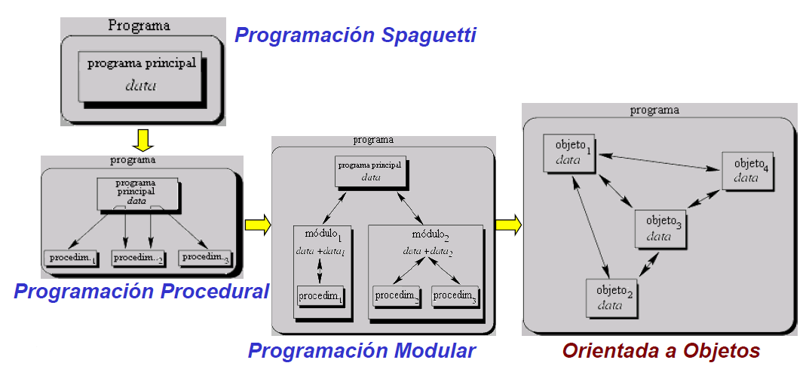
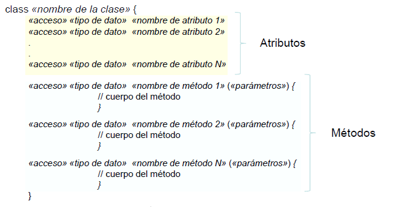
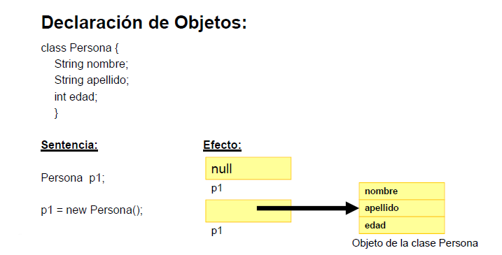

<div align="justify">

#  Code & Learn (Objetos en Java)

## Programacion orientado a objetos

La programación orientada a objetos es un paradigma surgido en los años 70, que utiliza objetos como elementos fundamentales en la construcción de la solución. Un objeto es una abstracción de algún hecho o ente del mundo real, con atributos que representan sus características o propiedades, y métodos que emulan su comportamiento o actividad. Todas las propiedades y métodos comunes a los objetos se encapsulan o agrupan en clases. Una clase es una plantilla, un prototipo para crear objetos; en general, se dice que cada objeto es una instancia o ejemplar de una clase. la POO está basado en varias técnicas, incluyendo herencia, cohesión, abstracción, polimorfismo, acoplamiento y encapsulamiento. Su uso se popularizó a principios de la década de los años 1990. En la actualidad, existe una gran variedad de lenguajes de programación que soportan la orientación a objetos.

### Evolucion



## Clases

Para definir una clase en JAVA, se emplea la palabra clave `class` seguida por el nombre de la clase, el cual se recomienda que esté escrito en singular e iniciando con letra mayúscula; este nombre debe ser representativo de los elementos que contiene la clase.

Ejemplo:

class Circulo
class Pago
class Caja
class Televisor
class Empleado
class Rectangulo
class Cliente
class Libro

**Forma de una clase:**



## Objetos

Es un ejemplar concreto de una clase. Las clases son como tipos de variables, mientras que los objetos son como variables concretas de un tipo determinado.

Sintaxis:

`«Nombre de la Clase» NombreDeObjeto;`

Ejemplo:

```java

Persona p1; p1 = new Persona();
Circulo cl; cl = new Circulo();

```

Cada objeto es una copia de una clase, se dice entonces que cada objeto de una clase dada contiene la estructura y el comportamiento definidos por la clase. A la creación de un objeto se le llama instancia de una clase. La clase es una construcción lógica, el objeto tiene la realidad física.

### Caracteristicas

- Estado (atributos o características).
- Comportamiento (métodos asociados).
- Identidad (ocupa un lugar en memoria).
- Ciclo de vida.
- Visibilidad.
- Relación y colaboración con otros objetos.

### Instanciar un objeto

Los objetos se crean en dos pasos:

- Declaración, donde se proporciona un nombre al objeto y se determina a que clase pertenece.

`NombreClase obj;`

- Se obtiene una copia física del objeto y se asigna a la variable, esto se hace con el operador `new`.

`obj = new NombreClase();`

Los dos pasos pueden llevarse a cabo en una sola instrucción así:

`NombreClase obj = new NombreClase();`

Representación gráfica:




## Atributos

Los atributos corresponden a las características (o datos) necesarios para describir una clase.
Los atributos pueden corresponder a cualquier tipo de dato (int, long, double, char, String, …, etc).

Ejemplo:

La clase “Persona” probablemente deberá tener definido los siguientes atributos:

```java

String codigo;
String nombre;
double salario_basico;
int edad;
char sexo;

```

** Consideraciones para la definición de Atributos: **

- El nombre debe cumplir con las reglas de los identificadores.
- El nombre debe orientar sobre el significado del dato que`almacena.
- Visibilidad - Tiene asociado un modificador de acceso: públicos, privados, package (default) ó protected.

## Metodos

Sintáxis:

```plain

«acceso» «tipo» «nombre del método» («parámetros») {
// cuerpo del método
}

```
Tipo: Corresponde al tipo de dato que retornará dicho método (int, long, float, double,`String, char,…, etc) a una clase definida previamente, o void si el método no retorna ningún dato. Todo método debe tener una clausula return a menos que éste sea de tipo void.

Parámetros: corresponde a un listado de declaración de variables separados por coma, que corresponde a los datos que el método requiere para realizar su función.

Ilustración gráfica de posibles métodos:


**Consideraciones para la definición de Métodos:**

- Tienen un nombre: debe cumplir las reglas de los identificadores.
- Por estándar inician en minúscula y si tienen palabras compuestas estas inician con mayúscula.
- Pueden retornar algo como resultado: un dato, un objeto o un arreglo.
- Pueden requerir de argumentos para hacer sus cálculos.
- Visibilidad - Tiene modificador de acceso asociado: públicos(public), privados(private), package (default) ó protegidos(protected).

## Setter y getter

Los setter y getters, son métodos de acceso en una clase, estos sirven para establecer y obtener datos de los atributos de nuestra clase, estos dos métodos deben ser públicos.

setter : para cambiar el valor de los atributos.
getter : para consultar o recuperar el valor de los atributos.

Ejemplo:

```java

public class Circulo {

public double radio; // declaración de atributo

public void setRadio ( double r ) { // cambia el valor del atributo radio por el valor

	radio = r;

	}

public double getRadio () { // Devuelve el valor del atributo radio

	return radio;

	}
}

```

>El uso del set y get es más de una buena practica de la programación, porque igual, funcionaria sin ponerle set y get al principio del nombre del método, pero al utilizarlo, el código será mas claro a la hora de realizarle alguna actualización.

## toString

El método toString de un objeto, retorna la representación de un objeto en formato cadena, pero este método hace parte de la clase padre Object, la cual, se llama en forma **implícita** cuando el objeto se utiliza en donde se espera un objeto String (por ejemplo, cuando printf imprime en pantalla el objeto como un String, usando el especificador de formato %s, o cuando el objeto se concatena con un objeto String mediante el operador +). Pero además, el método toString se puede llamar de manera **explícita**,  sobreescribir dicho método de la clase Object, en otra clase cualquiera y así darle el formato deseado a la representación del objeto de dicha clase.

Ejemplo utilizando los atributos comunes de una clase llamada Persona:

```java


public class Persona {

  private String nombre;
  private int edad;
  private String id;

  public Persona(String nombre, int edad, String id) {
    this.nombre = nombre;
    this.edad = edad;
    this.id = id;
  }


  public String getNombre() {
    return nombre;
  }

  public void setNombre(String nombre) {
    this.nombre = nombre;
  }

  public int getEdad() {
    return edad;
  }

  public void setEdad(int edad) {
    this.edad = edad;
  }

  public String getId() {
    return id;
  }

  public void setId(String id) {
    this.id = id;
  }

  @Override // Esto indica que una declaración de método está destinado a anular una declaración de método en una superclase.
  public String toString(){
    return "Nombre: " + nombre + "\nEdad: " + edad + "\nId: " + id;
  }

}

```

## Printf

El método System.out.printf (“f” significa “formato”) muestra datos en la consola con formato.

Sintaxis:

```java
System.out.printf(receptáculo y/o texto fijo, parametros...);
```

Ejemplo:

```java
System.out.printf("%s\n%s\n", "Bienvenido al", "repositorio de java!");
```

Los receptáculos son los simbolos % y hace referencia a cada parámetro del método a imprimir, en este caso a "Bienvenido al" y "repositorio de java". El caracter siguiente, representa el tipo de dato a imprimir, en este caso, la "s" equivale a una cadena y todo su conjunto "%s" se le llama especificador de formato.

La siguiente tabla resume los especificadores de formato de java:

**Impresión de enterios**

| Carácter de conversión | Descripción|
|------------------------|------------|
| d                      | Muestra un entero decimal (base 10)|
| o                      | Muestra un entero octal (base 8)|
| x o X                  | Muestra un entero hexadecimal (base 16).|

**Impresión de números de punto flotante**

| Carácter de conversión | Descripción|
|------------------------|------------|
| e o E                  | Muestra un valor de punto flotante en notación exponencial. El carácter de conversión E muestra la salida en letras mayúsculas.|
| f                      | Muestra un valor de punto flotante en formato decimal.|
| g o G                  | Muestra un valor de punto flotante en el formato de punto flotante f o en el formato exponencial e, con base en la magnitud del valor. Si la magnitud es menor que 10 a la menos 3,o si es mayor o igual que 10 a la 7, el valor de punto flotante se imprime en el formato f. Cuando se utiliza el carácter de conversión G, la salida se muestra en mayúscula. |
| a o A                  | Muestra un número de punto flotante en  formato hexadecimal. El carácter de conversión  A muestra la salida en letras mayúsculas.|

**Impresión de cadenas y caracteres**

| Carácter de conversión | Descripción|
|------------------------|------------|
| c o C                  | Muestra un carácter de tipo char (se requiere que el argumento sea de ese tipo).|
| s o S                  | Muestra una cadena. Puede recibir un objeto String o cualquier objeto Object como argumento.|


**Impresión de fechas y horas**

El carácter de conversión t o T, se utiliza para imprimir fechas y horas en diversos formatos. Siempre va seguido de un carácter de sufijo de conversión que especifica el formato de fecha y/o de hora. Cuando se utiliza el carácter de conversión T, las salidas se muestran en mayúsculas.

El carácter de conversión t requiere que su correspondiente argumento sea una fecha u hora de tipo long, Long, Calendar (paquete java.util) o Date (paquete java.util); los objetos de cada una de estas clases pueden representar fechas y horas. La Calendar es la más recomendada, ya que ciertos constructores y métodos de la clase Date se sustituyen por la clase Calendar.

| Carácter de sufijo de conversión | Descripción|
|------------------------|------------|
| c                | Muestra la fecha y hora con el formato dia mes fecha hora:minuto:segundo zona-horaria año|
| F                     | Muestra la fecha con el formato año-mes-dia con cuatro dígitos para el año y dos dígitos para el mes y la fecha (por ejemplo , 2016-07-16)|
| D                     | Muestra la fecha con el formato mes/dia/año, con dos dígitos para el mes, día y año (por ejemplo, 06/07/16)|
| r                     | Muestra la hora en formato de 12 horas como hora:minuto:segundo AM|PM, con dos dígitos para la hora, minuto y segundo (por ejemplo, 06:30:25 PM).|
| R                     | Muestra la hora con el formato hora:minuto, con dos dígitos para la hora y minuto (por ejemplo, 16:50). Se utiliza el reloj 24 horas.|
| T                     | Muestra la hora con el formato hora:minuto:segundo, con dos dígitos para la hora, minuto y segundo (por ejemplo, 16:30:25). Se utiliza el reloj de 24 horas.|
| A                     | Muestra el nombre completo del día de la semana.|
| a                     | Muestra el nombre corto de tres caracteres del día de la semana.|
| B                     | Muestra el nombre completo del mes|
| b                     | Muestra el nombre corto de tres caracteres del mes.|
| d                     | Muestra el día del mes con dos dígitos, rellenando con ceros a la izquierda si es necesario.|
| m                     | Muestra el mes con dos dígitos, rellenando con ceros a la izquierda si es necesario|
| H                     | Muestra la hora en el reloj de 24 horas, con un cero a la izquierda si es necesario|
| I                     | Muestra la hora en el reloj de 12 horas, con un cero a la izquierda si es necesario|
| k                     | Muestra la hora en el reloj de 24 horas sin ceros a la izquierda|
| l                     | Muestra la hora en el reloj de 12 horas sin ceros a la izquierda|
| M                     | Muestra los minutos con un cero a la izquierda, si es necesario|
| S                     | Muestra los segundos con un cero a la izquierda, si es necesario|
| Z                     | Muestra la abreviación para la zona horaria|
| p                     | Muestra el marcador de mañana o tarde en minúscula (pm)|
| P                     | Muestra el marcador de mañana o tarde en mayúscula (PM)|


Ejemplo de impresión con fechas y horas:

```java

import java.util.Calendar;

public class PruebaFechaHora
{
   public static void main( String[] args )
   {
      // obtiene la fecha y hora actuales
      Calendar fechaHora = Calendar.getInstance();

      // impresión con caracteres de conversión para composiciones de fecha/hora
      System.out.printf( "%tc\n", fechaHora );
      System.out.printf( "%tF\n", fechaHora );
      System.out.printf( "%tD\n", fechaHora );
      System.out.printf( "%tr\n", fechaHora );
      System.out.printf( "%tT\n", fechaHora );

      // impresión con caracteres de conversión para fechas
      System.out.printf( "%1$tA, %1$tB %1$td, %1$tY\n", fechaHora );
      System.out.printf( "%1$TA, %1$TB %1$Td, %1$TY\n", fechaHora );
      System.out.printf( "%1$ta, %1$tb %1$te, %1$ty\n", fechaHora );

      // impresión con caracteres de conversión para horas
      System.out.printf( "%1$tH:%1$tM:%1$tS\n", fechaHora );
      System.out.printf( "%1$tZ %1$tI:%1$tM:%1$tS %Tp", fechaHora );
   } // fin de main
} // fin de la clase PruebaFechaHora

```

**Otros caracteres de conversión**

| Carácter de conversión | Descripción|
|------------------------|------------|
| b o B                  | Imprime true o false para el valor de un boolean o Boolean. Estos caracteres de conversión también pueden aplicar formato al valor de cualquier referencia. |
| h o H                  | Imprime la representación de cadena del valor de código hash de un objeto en formato hexadecimal. Si el correspondiente argumento es null, se imprime "null". |
| %                      | Imprime el carácter de por ciento. |
| n                      | Imprime el separador de línea específico de la plataforma (por ejemplo, \r\n en Windows o \n en UNIX/LINUX) |

**Impresión con anchuras de campo y precisiones**

Se puede especificar el tamaño de un campo, implementando la anchura de campo, que consiste en insertar un entero entre el % y el carácter de conversión en el especificador de formato (ejemplo, %4d). Si el valor a mostrar es menor que la anchura de campo especificada, entonces el contenido se **justificarán a la derecha**. Si el valor a mostrar es mayor que la anchura de campo, entonces la anchura de campo se incrementa automáticamente para dar cavidad al valor.

Ejemplo:

```java


public class Main {

  public static void main(String[] args) {
    int dato = 123;
    System.out.printf("%5d\n", dato);
  }

}

```

> Para justificar a la derecha, solo de colocar un signo menos "-" después del % y antes del especificador de formato (por ejemplo, %-10d).

Podemos especificar la precisión con la que se muestra valores de puntos flotantes y cadenas. Cuando se utiliza con los caracteres de conversión de punto flotante e y f, la precisión es el número de dígitos que aparecen después del punto decimal. Cuando se utiliza con los caracteres de conversión g, a o A, la precisión es el número máximo de dígitos significativos a imprimir. Cuando se utiliza con el carácter de conversión s, la precisión es el número máximo de caracteres a escribir de la cadena. Para utilizar la precisión, se debe colocar entre el signo de porcentaje y el especificador de conversión un punto decimal (.), seguido de un entero que representa la precisión.

Ejemplo:

```java

System.out.printf("%.3f\n", 123.458763);
System.out.printf("%10.3f\n", 123.458763); // con anchura de campo 10.

```
**Impresión con índices como argumentos**

Sirve par darle un orden a los argumentos a mostrar. Es un entero opcional seguido del signo $, esto con el fin de darle una posición fija al argumento en la lista de argumentos.

Ejemplo:

```java

public class Main {

  public static void main(String[] args) {
      System.out.printf(
         "Lista de parametros sin reordenar: %s %s %s %s\n",
         "1er", "2do", "3er", "4to" );

         // imprime: 1er 2do 3er 4to

      System.out.printf(
         "Lista de parametros despues de reordenar: %4$s %3$s %2$s %1$s\n",
         "1er", "2do", "3er", "4to" );
        // imprime: 4to 3er 2do 1er
  }

}


```

**Impresión de literales y secuencias de escape**

| Carácter de conversión | Descripción|
|------------------------|------------|
| \'                     | Imprime el carácter de comilla sencilla |
| \"			 | Imprime el carácter de comilla doble |
| \\			 | Imprime el carácter barra diagonal inversa |
| \b			 | Desplaza el cursor una posición hacia atrás en la línea atual |
| \f			 | Desplaza el cursor al principio de la siguiente página lógica |
| \n			 | Desplaza el cursor al principio de la siguiente línea |
| \r			 | Desplaza el cursor al principio de la línea actual |
| \t			 | Desplazar el cursor hacia la siguiente posición del tabulador horizontal |

## Constructores

Un constructor es un método especial que sirve para darle valores inciales a los atributos cuando se crea un objeto de la clase correspondiente. Dicho método, se llama igual al nombre de la clase, no lleva ningún valor de retorno, ni tipo pero puede tener parámetros de entrada o no tenerlos.

Ejemplo:

```java

public class Circulo{

	private double radio;		// atributo.

	Circulo(){					// El constructor puede tener parámetros.
		radio = 3;
	}

}
```

## Licencia 📄

Este proyecto está bajo la Licencia (Apache 2.0) - mira el archivo [LICENSE.md](../../../../LICENSE) para detalles.

</div>
